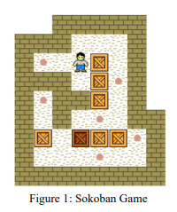
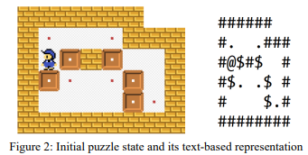

# Description

Note: This is is the first version of the game where stack of the game is implemented as an array.

Sokoban, which means ‘warehouse keeper’ in Japanese, is a transport puzzle game. In this game, the 
player tries to put boxes at designated locations by pushing them around a maze. The rules of this game 
are:

  * Only one box can be pushed at a time
  * Boxes cannot be pulled. Only pushing is allowed.
  * The player cannot walk through boxes or walls.
  * The number of the boxes is equal to the number of target locations.
  * The puzzle is solved when all boxes are on the target locations.

In this implementation, puzzles of size 6x8 blocks is used. The code holds a char array for the cells, and uses different ASCII 
characters for different cell states, as follows:

* ‘@’ : the player
* ‘.’ : target location
* ‘+’ : the player at a target location
* ‘ ’ (space) : empty cell
* ‘$’ : movable box
* ‘*’ : movable box at target location
* ‘#’ : wall

*An example puzzle and the corresponding representation is given in Fig.2.*

Gameplay works as follows:

* w, a, s, d keys should move the player to up, left, down and right, respectively. If the move 
is valid, the puzzle state is stored in the stack-queue, and printed to the console.
* z key undoes the last valid move. The last puzzle state is also removed from the queue-stack.
* r key replays all the moves starting from the initial state. All puzzle states are to be printed 
to the console in order.
